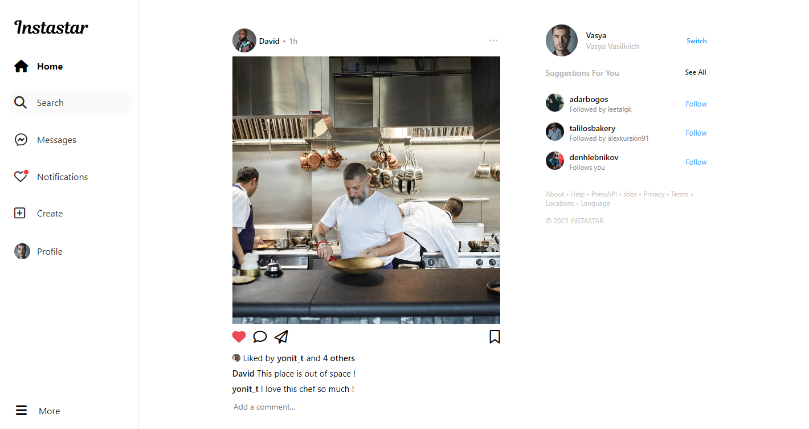
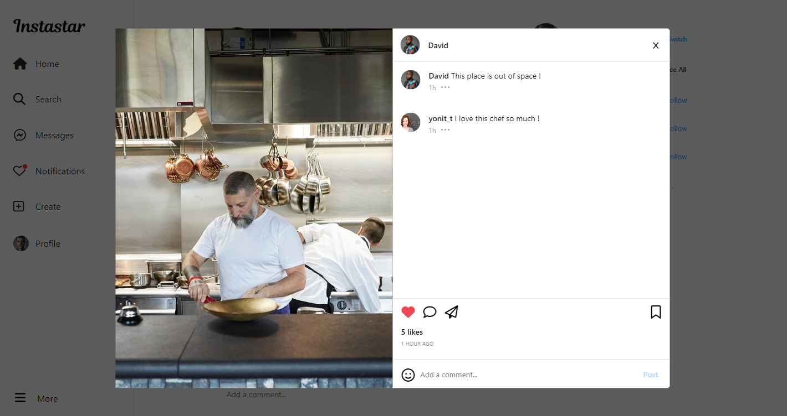
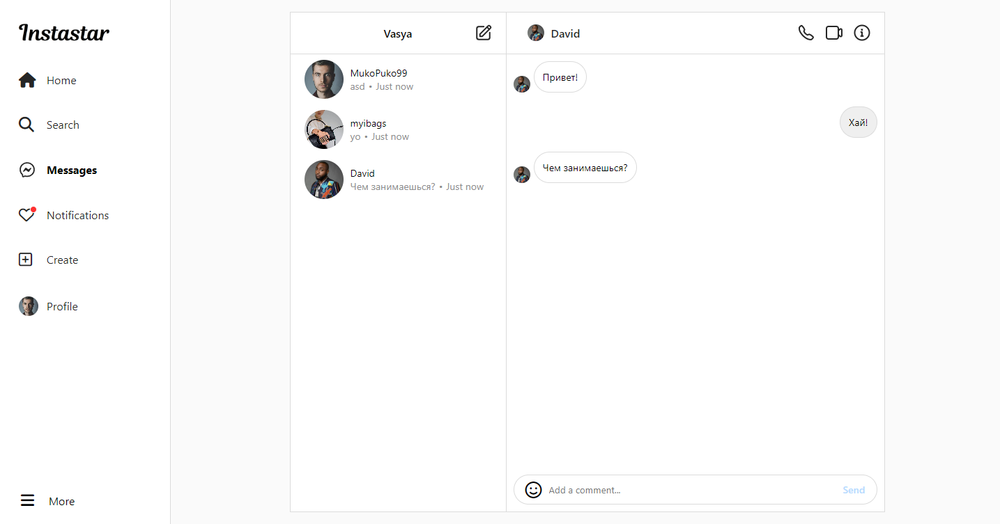
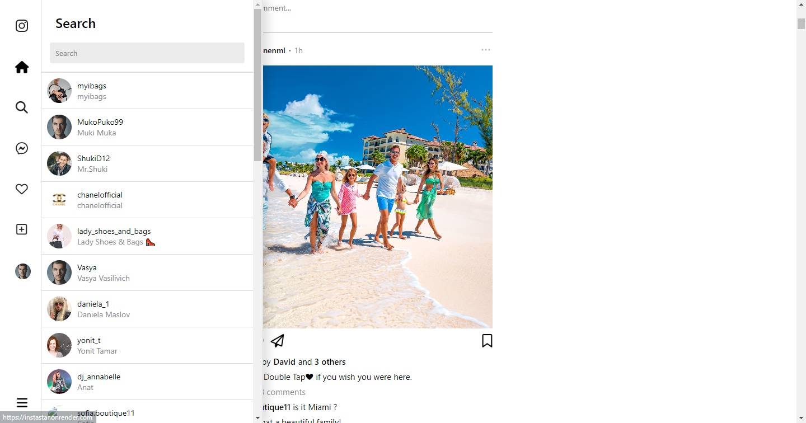
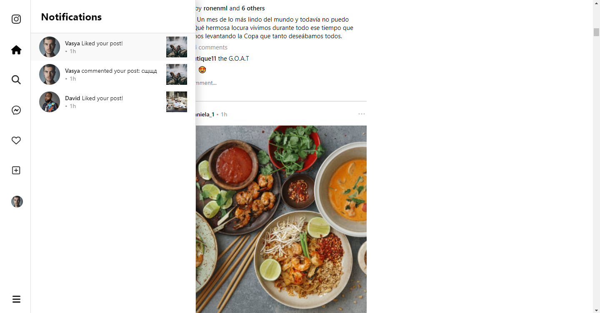

# Instastar

## 📜 About

Instagramm clone fullstack app.
You can create new posts and share it to your followers, leave likes and comments for your friends posts and also chat with them. 
## 🛠 Technology

- **Frontend**
  - React
  - Redux
  - SCSS
  - RestAPI
  - JS

- **Backend**
  - NodeJS
  - Express
  - WebSockets
    
- **DataBase**
  - MongoDB

- **ProjectScreenshots**

  
  ## Profile Page
  

  ## Home Page
  

  ## Post View

  ## Live Chat

  ## Search

  ## Notifications

